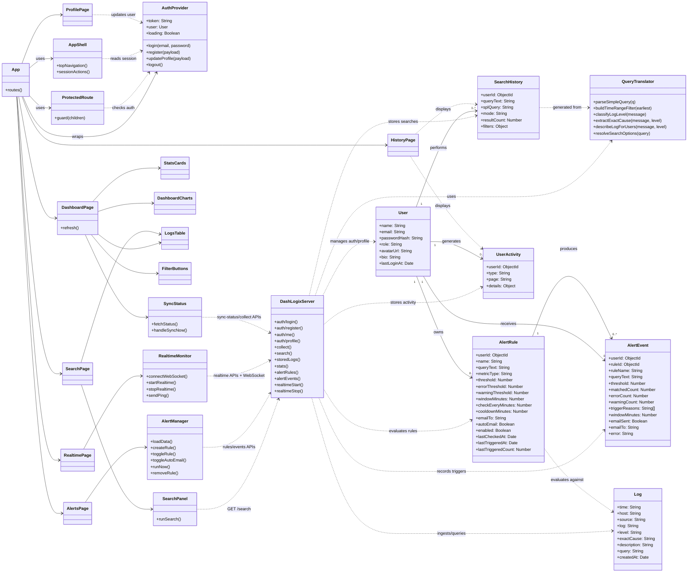

# DashLogix Class Diagram

This project is mostly built with functional React components and Mongoose models rather than traditional ES6 classes, so the diagram below is a UML-style structural view of the main domain entities, service modules, and UI components.

## Source Basis

- Backend models: `dashlogix-backend/models/*.js`
- Backend orchestration and APIs: `dashlogix-backend/server.js`
- Query parsing utilities: `dashlogix-backend/utils/queryTranslator.js`
- Frontend routing and auth shell: `dashlogix-frontend/src/App.jsx`, `dashlogix-frontend/src/context/AuthContext.jsx`, `dashlogix-frontend/src/components/layout/AppShell.jsx`
- Main feature pages/components: `dashlogix-frontend/src/pages/*.jsx`, `dashlogix-frontend/src/components/*.jsx`
